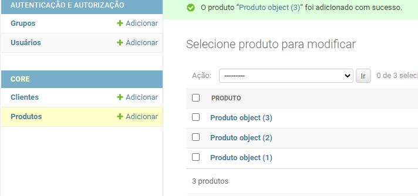
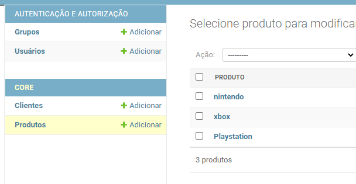

# Área Admin

Quando é feito a autenticação (django.contrib.auth), é criado uma sessão, criada pela aplicação sessions (django.contrib.sessions) e a troca de mensagens entra as aplicações 
gerenciada pelo messages ((django.contrib.messages). E é possível utilizar arquivos 
estaticos como html, css, javascript por conta da aplicação staticfiles (django.contrib.staticfiles) e apresentar diferentes conteúdos devido ao contenttypes(django.contrib.contenttypes)

Para criar um superusuário:

```bash
$ python manage.py createsuperuser
Usuário (leave blank to use 'xxx'): admin
Endereço de email:
Password:
Password (again):
A senha é muito parecida com usuário
Esta senha é muito curta. Ela precisa conter pelo menos 8 caracteres.
Esta senha é muito comum.
Bypass password validation and create user anyway? [y/N]: y
Superuser created successfully.
```

Quando uma aplicação é criada, é criado o arquivo admin.py.
Para adicionar o
Projetos\core\admin.py:

```python

from django.contrib import admin

from .models import Produto, Cliente

admin.site.register(Produto)
admin.site.register(Cliente)

```

Depois de entrar na Admin e cadastrar os produtos,
o nome deles aparece como:



Para aparecer o nome que deseja, tem que ir em models e acrescentar 
a função __str__:

```python
from django.db import models

class Produto(models.Model):
    nome = models.CharField('Nome', max_length=100)
    preco = models.DecimalField('Preço', decimal_places=2, max_digits=8)
    estoque = models.IntegerField('Quantidade em Estoque')
    
    def __str__(self):
        return self.nome
    

class Cliente(models.Model):
    nome = models.CharField('Nome', max_length=100)
    nome = models.CharField('Sobrenome', max_length=100)
    email = models.EmailField('E-mail', max_length=100)
    
    #Apresenta o objeto python da forma desejada,
    #no caso aqui, o nome dele.
    def __str__(self):
        return self.nome
```

Recarregar a página:




Caso queria que apareça outros campos na area admin,
modificar o arquivo admin.py:

```python
from django.contrib import admin

from .models import Produto, Cliente

class ProdutoAdmin(admin.ModelAdmin):
    list_display = ('nome', 'preco', 'estoque')

class ClienteAdmin(admin.ModelAdmin):
    list_display = ('nome', 'sobrenome', 'email')

admin.site.register(Produto, ProdutoAdmin)
admin.site.register(Cliente, ClienteAdmin)

```

O aquivo admin.py serve justamente para importar nossos modelos
e registra na administração.
