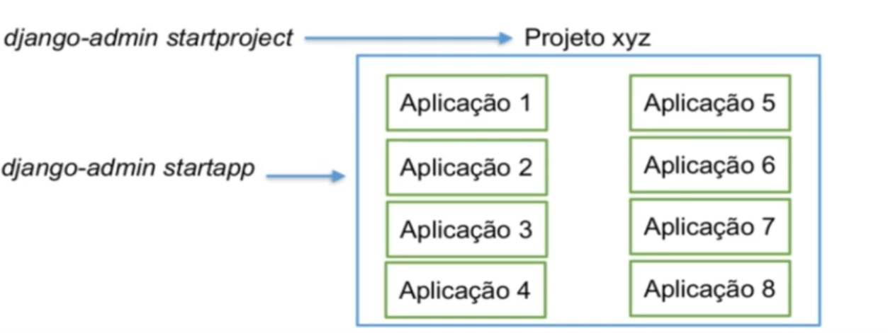

# Projetos x Aplicações

O projeto engloba o todo e aplicações plugáveis. Ou seja, em um projeto Django,
podemos ter várias aplicações, cada uma com sua tarefa específica, e estas
aplicações depois de criadas podem ser utilizadas por outros projetos.

